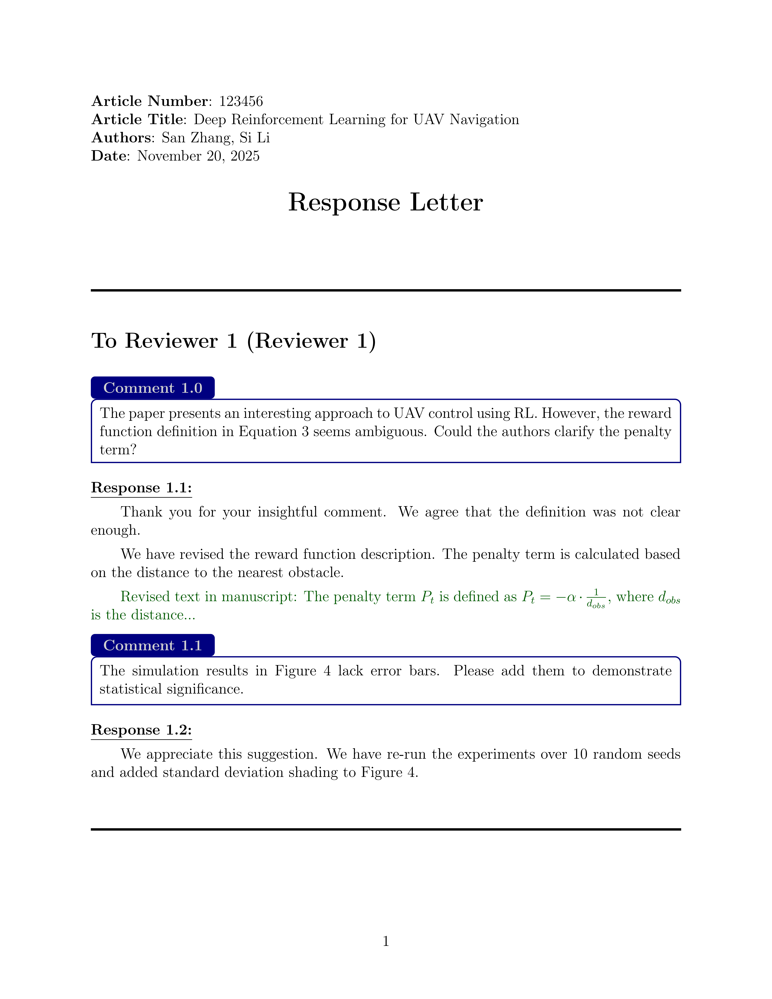
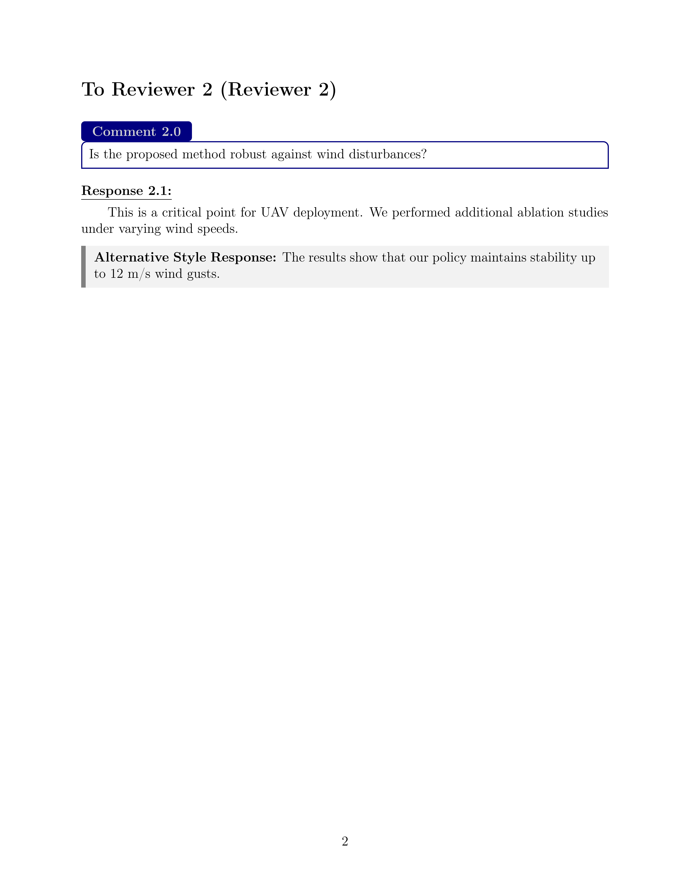

# Academic Paper Rebuttal Template

A professional LaTeX template for writing structured and visually appealing response letters to peer reviewers for academic papers.

## Overview

1. **Comment Boxes** (`reviewcomment` environment):
   - Navy-blue borders and headers
   - Automatic numbering (Reviewer X.Comment Y)
   - Clean, professional appearance
   - Breakable across pages

2. **Response Formatting** (`\response` command):
   - Automatic underline and bold formatting
   - Consistent numbering with comments
   - Color customization support

3. **Revised Text Highlighting** (`\revised` command):
   - Dark green text color for revised manuscript content
   - Easy identification of changes

4. **Reviewer Sections** (`\reviewer` command):
   - Automatic section creation with dividers
   - Sequential reviewer numbering
   - Clear visual separation

### Visual Examples

The template includes sample output demonstrating:
- Professional comment formatting with reviewer responses
- Integration of revised text snippets
- Multiple reviewer sections
- Alternative response styling options

